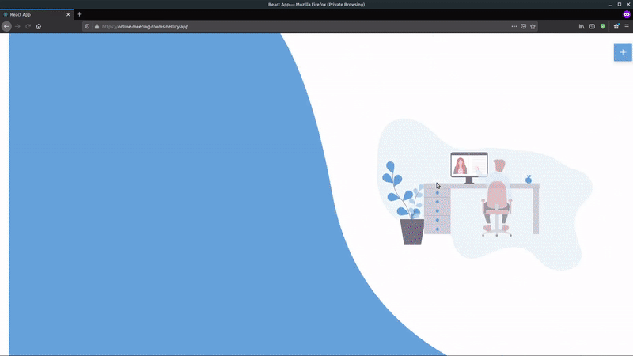
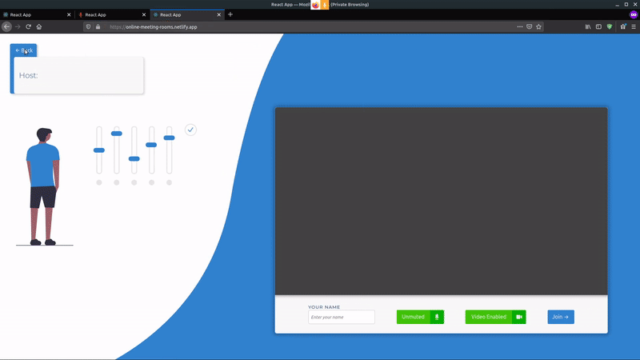

# Projekat Online Meeting Rooms

Projekat u okviru kursa Računarske mreže na IV godini I smera Matematičkog fakulteta. Izabrana tema je alat za sastanke, koji svojim korisnicima omogućava da bez  naloga prave nove sobe za sastanke i pridružuju se postojećim. Sobe koje su već kreirane mogu se pregledati na početnoj strani, a korisnici koji su već u nekoj od napravljenih soba mogu kopirati url adresu na kojoj se nalaze i poslati drugima, kako bi se novi korisnici lakše pridružili željenoj sobi.

## :electric_plug: Korišćene tehnologije i alati

- Design
  - Adobe XD

- Frontend
  - React.js

    Biblioteke:
      - styled-components (za pisanje css u okviru React komponenti)
      - redux (za state management)
      - framer-motion (za animacije)
      - react-router (za rutiranje single page aplikacije)
    
- Backend
  - Node.js

    Biblioteke:
      - express (za implementaciju servera)
      - socket.io (za sokete)
      - peer.js (za direktnu vezu izmedju klijenata, putem WebRTC protokola, za prenos videa)
  
- Deployment
  - Netlify (za klijentski deo)
  - Heroku (za server)
  

## :earth_africa: Probaj online

:warning: Server ćebiti nestabilan dana 10. januara, zbog testiranja uoči obrane zakazane za 11. januar.

:warning: U trenutnoj fazi, za ispravno funkcionisanje aplikacije, neophodno je da svi korisnici odobre pristup kameri i mikrofonu.

:warning: Sajt nije optimizovan za manje veličine ekrana. Ako ne vidite sadržaj kao što je prikazan u demo-u ispod, molim vas da koristite Ctrl+- za prilagodjavanje sadržaja. Ovo će biti popravljeno čim prodje ispitni rok!

Projekat je dostupan uzivo na sledecem [linku](https://online-meeting-rooms.netlify.app/).

## :computer: Prikaz rada aplikacije





## 🔨 Probaj lokalno

Neophodno je da na sistemu imate instaliran:

- [Git](#)
- [Node.js](https://nodejs.org/en/)
- [NPM](https://www.npmjs.com/)


```shell
git clone https://github.com/MATF-Computer-Networks-Projects/2020_Online-Meeting-Rooms
cd 2020_Online-Meeting-Rooms
cd code/client
npm install
npm start
cd ../server
npm install
npm start
```

## Autor
- [Filip Filipovic, 113/2017](http://alas.matf.bg.ac.rs/~mi17113/)
